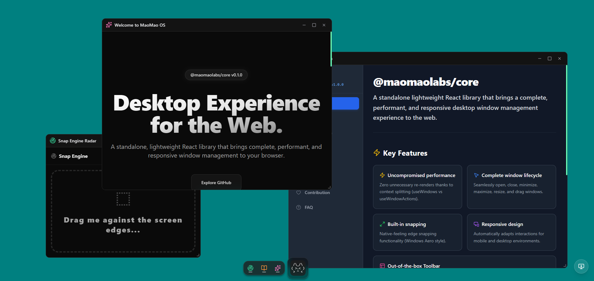
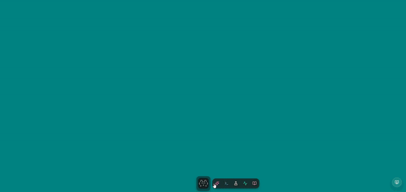
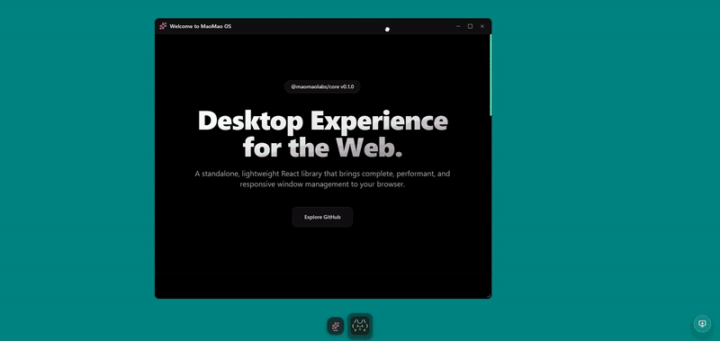
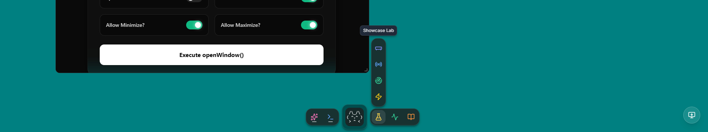
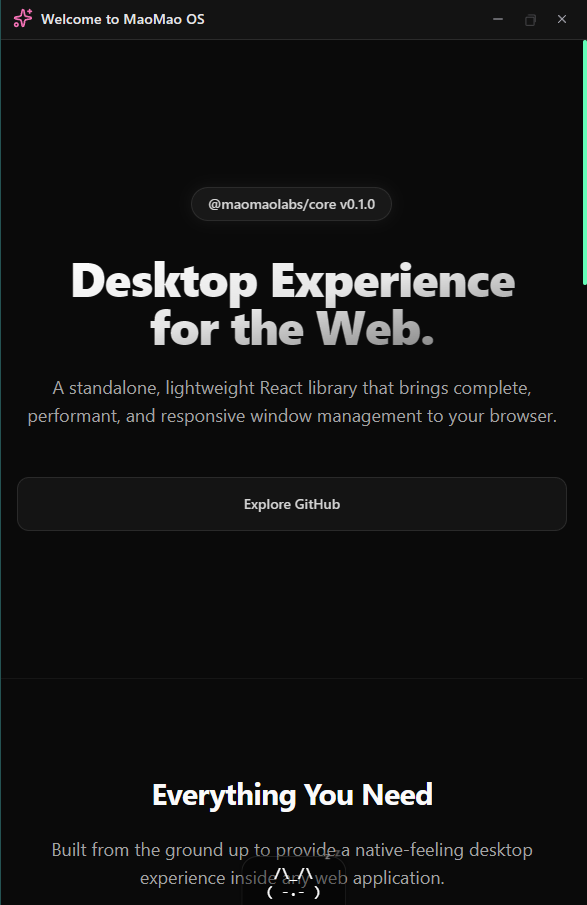
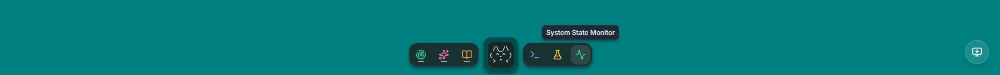
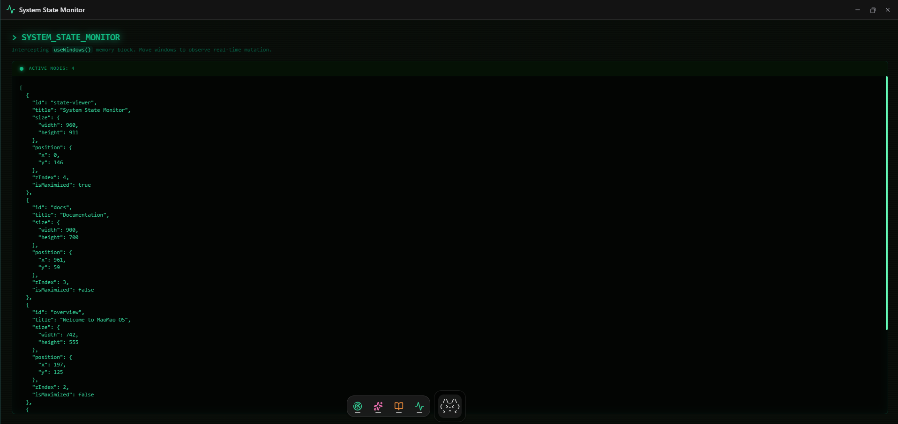

<div align="center">

  

  <h1>@maomaolabs/core</h1>

  <p><strong>A standalone, lightweight React library that brings a complete desktop window management experience to the web.</strong><br/>Drag, resize, snap, minimize, maximize — all performant and mobile-ready out of the box.</p>

  <p>
    <a href="https://www.npmjs.com/package/@maomaolabs/core"></a>
    <a href="https://github.com/maomaolabs/core/blob/main/LICENSE"></a>
    <a href="./CHANGELOG.md"></a>
    
  </p>

</div>

---

## ✨ Features

<table>
  <tr>
    <td width="50%">
      <h3>⚡ Zero unnecessary re-renders</h3>
      Context is split into <code>useWindows</code> (state) and <code>useWindowActions</code> (actions). Components that only dispatch actions never re-render on state changes.
      <br/><br/>
      
    </td>
    <td width="50%">
      <h3>🪟 Complete window lifecycle</h3>
      Open, close, minimize, maximize, drag and resize windows with native-feeling interactions on both desktop and mobile.
      <br/><br/>
      
    </td>
  </tr>
  <tr>
    <td width="50%" valign="top">
      <h3>🧲 Built-in snapping</h3>
      Half-screen (edge) and quarter-screen (corner) snapping with real-time preview overlays, just like a native OS.
      <br/><br/>
      
    </td>
    <td width="50%" valign="top">
      <h3>🧰 Out-of-the-box Toolbar</h3>
      A fully customizable taskbar that handles individual app launchers, folder groupings, and minimized window management.
      <br/><br/>
      
    </td>
  </tr>
</table>

<div align="center">
  <h3>📱 Responsive by default</h3>
  Interactions automatically adapt between mouse and touch environments. No configuration needed.
  <br/><br/>
  
</div>

---

## 📦 Installation

```bash
npm install @maomaolabs/core
# or
yarn add @maomaolabs/core
# or
pnpm add @maomaolabs/core
```

> Requires `react` and `react-dom` >= 18.0.0 as peer dependencies.

---

## 🚀 Quick Start

```tsx
import { WindowSystemProvider, WindowManager, useWindowActions } from '@maomaolabs/core';
import '@maomaolabs/core/dist/style.css';

const AppLauncher = () => {
  const { openWindow } = useWindowActions();

  return (
    <button onClick={() => openWindow({
      id: 'hello',
      title: 'Hello World',
      component: <div>Hello from a managed window!</div>
    })}>
      Launch App
    </button>
  );
};

export default function App() {
  return (
    <WindowSystemProvider>
      <WindowManager />
      <AppLauncher />
    </WindowSystemProvider>
  );
}
```

> ⚠️ Don't forget the CSS import — it's required for drag, resize, and snap overlays to work correctly.

---

## 📖 Usage Guide

### With Toolbar

The `Toolbar` component provides a ready-made taskbar with app launchers, folder support, and minimized window restoration.



```tsx
import { WindowSystemProvider, WindowManager, Toolbar } from '@maomaolabs/core';

const DESKTOP_ITEMS = [
  {
    id: 'browser',
    title: 'Browser',
    component: <div />,
    initialSize: { width: 800, height: 600 }
  },
  {
    id: 'games-folder',
    title: 'Games',
    apps: [
      { id: 'minesweeper', title: 'Minesweeper', component: <div /> }
    ]
  }
];

export default function Desktop() {
  return (
    <WindowSystemProvider>
      <WindowManager />
      <Toolbar toolbarItems={DESKTOP_ITEMS} showLogo={true} />
    </WindowSystemProvider>
  );
}
```

### Accessing Window State

Use `useWindows` when you need to render UI based on open windows (e.g., a custom taskbar or badge counter).



> ⚠️ **Warning:** `useWindows` triggers a re-render on **every** window state change (drag, resize, focus). Only use it where necessary.

```tsx
import { useWindows } from '@maomaolabs/core';

const OpenAppCounter = () => {
  const windows = useWindows();
  return <div>Active windows: {windows.length}</div>;
};
```

---

## 📚 API Reference

### Components

| Component | Description | Props |
| :--- | :--- | :--- |
| `WindowSystemProvider` | Root context provider. Wrap your entire app with this. | `children: ReactNode`, `systemStyle?: SystemStyle` |
| `WindowManager` | Renders all active windows and snap preview overlays. | — |
| `Toolbar` | Taskbar with app launchers and folder support. | `toolbarItems: ToolbarItem[]`, `showLogo?: boolean` |

### Hooks

#### `useWindowActions()`
Returns window manipulation methods. **Does not subscribe to window state** — safe to call anywhere without performance concerns.

| Method | Signature | Description |
| :--- | :--- | :--- |
| `openWindow` | `(window: WindowDefinition) => void` | Opens a new window, or focuses it if already open. |
| `closeWindow` | `(id: string) => void` | Destroys a window instance. |
| `focusWindow` | `(id: string) => void` | Brings a window to the top of the z-index stack. |
| `updateWindow` | `(id: string, data: Partial<WindowInstance>) => void` | Patches an existing window's state. |

#### `useWindows()`
Returns `WindowInstance[]` — the list of all currently active windows. Re-renders on every state change.

#### `useWindowSnap()`
Returns `{ snapPreview, setSnapPreview }` for reading and controlling the active snap preview overlay.

---

### Interfaces

#### `WindowDefinition`

| Property | Type | Required | Description |
| :--- | :--- | :---: | :--- |
| `id` | `string` | ✅ | Unique identifier for the window. |
| `title` | `string` | ✅ | Text shown in the window title bar. |
| `component` | `ReactNode` | ✅ | Content rendered inside the window. |
| `icon` | `ReactNode` | — | Icon shown in the title bar and toolbar. |
| `initialSize` | `{ width: number; height: number }` | — | Starting dimensions in pixels. |
| `initialPosition` | `{ x: number; y: number }` | — | Starting coordinates in pixels. |
| `layer` | `'base' \| 'normal' \| 'alwaysOnTop' \| 'modal'` | — | Z-index render layer. |
| `isMaximized` | `boolean` | — | Spawns the window in maximized state. |
| `canMinimize` | `boolean` | — | Shows the minimize control. |
| `canMaximize` | `boolean` | — | Shows the maximize/restore control. |
| `canClose` | `boolean` | — | Shows the close control. |
| `className` | `string` | — | Inject custom CSS classes directly into the window container. |
| `style` | `React.CSSProperties` | — | Inject inline styles overriding or extending window container styles. |

#### `FolderDefinition`

| Property | Type | Required | Description |
| :--- | :--- | :---: | :--- |
| `id` | `string` | ✅ | Unique identifier for the folder. |
| `title` | `string` | ✅ | Folder display name. |
| `apps` | `WindowDefinition[]` | ✅ | Windows grouped inside this folder. |
| `icon` | `ReactNode` | — | Optional visual icon. |

> `ToolbarItem = WindowDefinition | FolderDefinition`

#### `WindowStyling`

Exported type available for reuse in your own components:

```ts
import type { WindowStyling } from '@maomaolabs/core';
// { className?: string; style?: React.CSSProperties }
```

---

## ⚙️ Styling

The library requires a single CSS import to function correctly:

```tsx
import '@maomaolabs/core/dist/style.css';
```

Ensure your bundler (Vite, Webpack, etc.) is configured to process CSS from `node_modules`.

### Theming System (`systemStyle`)

The context provider accepts a `systemStyle` prop that governs the aesthetics of the entire rendered window manager system:

```tsx
<WindowSystemProvider systemStyle="aero">
```

Pre-bundled themes include:
- `default`
- `traffic` (colored dot buttons concept)
- `linux` (modern dark/light gradient adaptation)
- `yk2000` (classic 90s/00s retro styling)
- `aero` (translucent glass blurring)

**Note on Custom Themes**: `SystemStyle` strictly autocompletes the pre-built themes above, but mathematically permits *any* string to be passed via Type relaxation. You can pass your own `systemStyle="my-custom-theme"` alongside injected custom CSS.

### Custom Theme Injection

You can define your own theme by creating a CSS file that targets the `data-system-style` attribute.

> ⚠️ Use standard CSS attribute selectors — **avoid `:global()`** unless your bundler explicitly supports it (e.g. CSS Modules with PostCSS).

```css
/* my-custom-theme.css */
[data-system-style="my-custom-theme"] .window-header {
  background: #1a1a2e;
  color: #e0e0e0;
}

[data-system-style="my-custom-theme"] .window-controls {
  gap: 6px;
}
```

Import the CSS file anywhere in your app (e.g. `src/index.tsx`) before the provider renders:

```tsx
import './my-custom-theme.css';
```

Then pass the identifier to the provider:

```tsx
<WindowSystemProvider systemStyle="my-custom-theme">
  {/* ... */}
</WindowSystemProvider>
```

#### Available CSS selectors

The following global class names are always present on the window DOM and safe to target in your theme:

| Selector | Element |
| :--- | :--- |
| `.window-container` | Root window wrapper |
| `.window-header` | Title bar (drag area) |
| `.window-title` | Title text container |
| `.window-icon` | Icon inside the title bar |
| `.window-controls` | Button group (minimize / maximize / close) |
| `.terminal-btn` | Generic control button |
| `.window-scrollbar` | Scrollable content area |
| `.window-resize-handle` | Bottom-right resize grip |

You can also target individual buttons via the `data-action` attribute:

```css
[data-system-style="my-custom-theme"] [data-action="close"] { background: red; }
[data-system-style="my-custom-theme"] [data-action="maximize"] { background: green; }
[data-system-style="my-custom-theme"] [data-action="minimize"] { background: yellow; }
```

#### Per-window inline overrides

Custom `className` and `style` props are accepted on each individual window definition via `openWindow()`, allowing per-instance overrides on top of the global theme:

```tsx
openWindow({
  id: 'my-app',
  title: 'My App',
  component: <div />,
  className: 'my-extra-class',
  style: { borderRadius: '16px', border: '1px solid #444' },
});
```

These are merged after the global theme styles, so they always take precedence.

---

## 🤝 Contributing

```bash
npm install       # Install dependencies
npm run dev       # Start dev server with hot reload
npm run test      # Run test suite (Vitest)
```

PRs are welcome. Please ensure all tests pass before submitting.

---

## 📝 License

MIT © [MaoMao Labs](https://github.com/maomaolabs)
